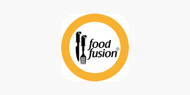

# 🍽️ Food Fusion - Recipe Website

A modern, responsive food recipe website built with HTML5 and CSS3, featuring delicious recipes and an elegant user interface.



## 📋 Table of Contents
- [Features](#features)
- [Demo](#demo)
- [Technologies Used](#technologies-used)
- [Project Structure](#project-structure)
- [Installation](#installation)
- [Usage](#usage)
- [Screenshots](#screenshots)
- [Contributing](#contributing)
- [License](#license)
- [Contact](#contact)

## ✨ Features

- **Responsive Design**: Optimized for desktop and mobile devices
- **Modern UI**: Clean and professional interface with smooth hover effects
- **Recipe Showcase**: Featured recipes with high-quality images
- **Easy Navigation**: Simple and intuitive navigation menu
- **Food Categories**: Organized recipe sections including:
  - Quick Recipes (Spicy Chicken Karahi)
  - Today's Special (Creamy Butter Chicken)
  - Sweet Treats (Chocolate Lava Cake)

## 🚀 Demo

Visit the live website: [Food Fusion Website](#) *(Add your deployed URL here)*

## 🛠️ Technologies Used

- **HTML5**: Semantic markup and structure
- **CSS3**: Modern styling with flexbox layout
- **Responsive Design**: Mobile-first approach
- **Custom Fonts**: Arial font family for clean typography

## 📁 Project Structure

```
FoodFusion/
├── index.html              # Main HTML file
├── styles.css              # CSS stylesheet
├── README.md               # Project documentation
├── logo.png                # Website logo
└── images/
    ├── chicken-karahi.jpeg  # Recipe image
    ├── creamychicken.jpeg   # Recipe image
    └── chocolava.jpeg       # Dessert image
```

## 💻 Installation

1. **Clone the repository**
   ```bash
   git clone https://github.com/yourusername/food-fusion.git
   ```

2. **Navigate to the project directory**
   ```bash
   cd food-fusion
   ```

3. **Open in your browser**
   - Simply open `index.html` in your preferred web browser
   - Or use a local server like Live Server extension in VS Code

## 🎯 Usage

1. **Home Page**: Browse featured recipes and today's specials
2. **Navigation**: Use the top navigation menu to explore different sections
3. **Recipe Cards**: Click on recipe images to view detailed information
4. **Responsive**: Enjoy the website on any device - desktop, tablet, or mobile

## 📱 Screenshots

### Desktop View
 *(Add screenshot)*

### Mobile View
 *(Add screenshot)*

## 🎨 Design Features

- **Color Scheme**: 
  - Primary: Black (#000) for headers and footer
  - Accent: Golden Yellow (#F4A900) for navigation
  - Background: Light Gray (#F9F9F9)
  - Content: White with subtle shadows

- **Layout**: 
  - Flexbox-based responsive design
  - Three-column layout with sidebars and main content
  - Card-based recipe presentation

- **Typography**: 
  - Arial font family for readability
  - Bold headings with appropriate sizing
  - Clean paragraph text

## 🔧 Customization

To customize the website:

1. **Colors**: Modify the color variables in `styles.css`
2. **Content**: Update recipe information in `index.html`
3. **Images**: Replace images in the project folder
4. **Fonts**: Change font family in the CSS file

## 🤝 Contributing

Contributions are welcome! Please feel free to submit a Pull Request.

1. Fork the project
2. Create your feature branch (`git checkout -b feature/AmazingFeature`)
3. Commit your changes (`git commit -m 'Add some AmazingFeature'`)
4. Push to the branch (`git push origin feature/AmazingFeature`)
5. Open a Pull Request

## 📝 License

This project is licensed under the MIT License - see the [LICENSE](LICENSE) file for details.

## 👨‍💻 Author

**Your Name**
- GitHub: [@yourusername](https://github.com/yourusername)
- Email: your.email@example.com
- LinkedIn: [Your LinkedIn](https://linkedin.com/in/yourprofile)

## 🙏 Acknowledgments

- Food images from various sources
- Inspiration from modern food websites
- Thanks to the web development community

---

⭐ **Star this repository if you found it helpful!**

*Made with ❤️ by [Your Name]*
